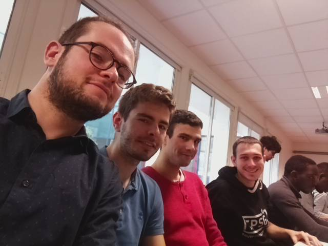
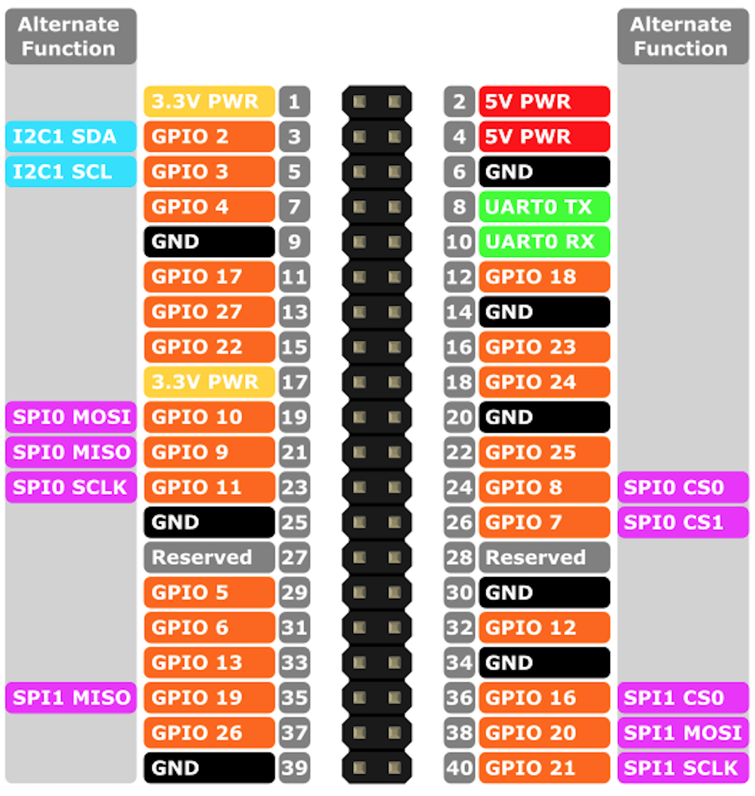
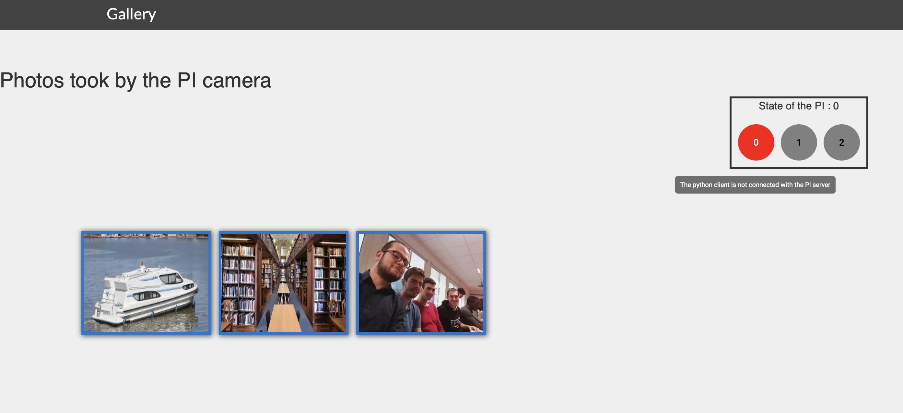
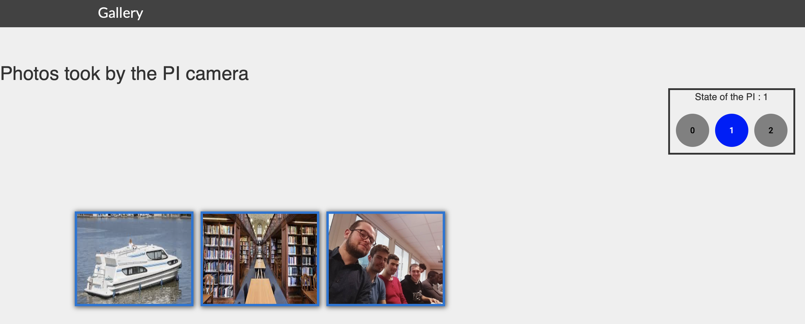
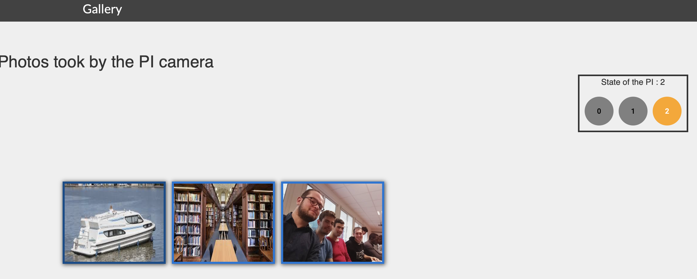

# **Projet Linux embarqué : Caméra IP basée sur une Raspberry pi.**

# Introduction

## Groupe

Le groupe de projet est composé de :

* Nathan Fourniol
* Clément Bichat
* Aurélien Grenier
* Guillaume Le Boucher




## Sujet du Projet

L'intitulé du projet se situe à l'adresse suivante : [sujet](Sujet_Projet_Camera.md)

L'objectif principal est de mettre en place une caméra IP à l'aide d'une RPI3 puis de prendre des photos avec cette dernière en contrôlant son état.

## Fonctionnalités proposées par notre projet

1. Prendre une photo à distance via un terminal et la visualiser sur une gallery web que l'on déploiera en local sur notre machine.

2. Avoir des informations de l'état de la caméra physiquement via des LEDs de couleur branchées par GPIO sur la carte.


Vous trouverez dans ce README les sections suivantes :


*  **Configuration du système :** Cette section va expliquer l'ensemble des étapes nécessaires à la configuration de notre système. Ce dernier est composé de la RPI3, de la caméra et de l'interface graphique pour la visualisation. On y retrouvera donc une description des étapes : de la récupération de l'os, de la compilation des librairies, du flashage de la carte SD...

* **Utilisation du système :** Cette section va décrire la marche à suivre afin qu'un utilisateur puisse utiliser la caméra IP avec la RPI3 et visualiser à la fois les photos et l'état courant du système via l'interface Angular.


# Configuration du système

## 1 . Récupération de l'os embarqué

On utilisera Buildroot pour compiler et paramétrer notre système d'exploitation embarqué.
Pour ce projet, une tarball Buidroot est disponible par l'intermédiaire d'une image Docker. Cette tarball contient l'os précompilé, contenant quelques librairies et outils.

Commande pour récupérer l'image et créer le conteneur Docker :

```
sudo docker pull pblottiere/embsys-rpi3-buildroot-video
sudo docker run -it pblottiere/embsys-rpi3-buildroot-video /bin/bash

```
On peut ensuite extraire l'os :

```
cd /root
tar zxvf buildroot-precompiled-2017.08.tar.gz

```

## 2. Flashage de la carte SD

Il faut tout d'abord sortir l'image de l'os du docker :

`docker cp <container_id>:/root/buildroot-precompiled-2017.08/output/images/sdcard.img`

Puis ensuite flasher :

`sudo dd if=sdcard.img of=/dev/sdb`

Bien vérifier le chemin de la carte SD ( en s'aidant de lsblk par exemple).

La carte SD possède donc deux partitions. Il faut ajouter dans le fichier
`config.txt` de la première partition.

```
start_x=1
gpu_mem=128

```


## 3. Cross compilation des librairies du serveur serveur

Pour récupérer les images de la caméra sur la Raspberry, nous nous basons sur l'API V4L qui est une API vidéo dédiée aux systèmes Linux. Ainsi, dans le docker, pour l'installer et la configurer :

* il faut récupérer le projet :

`git pull https://github.com/GuillaumeLeBoucher/Projet_LinuxEmbarque`

* Pour compiler la partie serveur on va utiliser les autotools qui vont nous permettre d'adapter la compilation à notre cible embarquée :

```
cd Serveur
./autogen.sh
./configure CC=./../../buildroot-precompiled-2017.08/output/host/usr/bin/arm-linux-gcc --host=arm-linux
make
make install

```

Il faut ensuite sortir du docker et copier le binaire `v4l2grab` ainsi que le fichier python led.py sur la Raspberry soit en ftp (avec Filezilla par exemple) soit en les copiant directement dans la bonne partition de la carte SD.

## 4. Branchement leds de contrôle

On utilise deux leds, une bleue et une rouge.
Il faut brancher la borne + de la led bleue au GPIO 13 et celle de la led rouge sur le GPIO 11.

La signification du code couleur :

* Mise sous tension de la Raspberry : *aucune led allumée*
* "Socket initialisé et binded", premières données échangées entre le serveur et le client (transmission en UDP donc pas de connexion) : *led bleue allumée*  
* Prise photo et transmission : *leds bleue et rouge allumées*





## 5. Installation du client

<!-- [Install on Ubuntu](https://linuxize.com/post/how-to-install-node-js-on-ubuntu-18.04/)
cd App-web
npm install
It may take few seconds


## Lancer l'afficheur node :
npm start -->

<p style="text-align:justify";>

 **Interface graphique App-Web** : Pour initialiser l'application web, il faut au préalable installer **nodeJS** et **npm**. Voici les étapes à suivre pour une distribution Ubuntu 18.04 (d'autres modes d'installation disponible sur ce site : https://linuxize.com/post/how-to-install-node-js-on-ubuntu-18.04/)   

</p>

Activez le dépôt NodeSource en exécutant le curl suivant en tant qu'utilisateur ayant les privilèges sudo :


```
curl -sL https://deb.nodesource.com/setup_12.x | sudo -E bash -
```


La commande ajoutera la clé de signature NodeSource à votre système, créera un fichier de dépôt des sources apt, installera tous les paquets nécessaires et rafraîchira le cache apt.

Une fois que le dépôt NodeSource est activé, installez Node.js et npm en tapant :

```
sudo apt install nodejs
```
Le paquet nodejs contient à la fois les binaires node et npm.

Vérifiez que le Node.js et le npm ont été installés avec succès en regardant leurs versions :
```
node --version
npm --version
```
Une fois npm installé, il faut lancer npm install afin d'installer toutes les dépendances du projet :
```
npm install

```


## 6. Informations sur l'interface de visualisation

<p style="text-align:justify";>

 Nous avons décider d'utiliser une interface Angular car Guillaume l'a utilisée lors de son stage d'assistant ingénieur. Angular est un framework JavaScript dont la description est disponible ici : https://angular.io/features.  
L'idée initiale était de placer le serveur web sur la Raspberry mais nous n'avons pas pu installer les librairies nécessaires sur la carte. De plus, un serveur AngularJS n'aurait pas été adapté du point de vue de l'embarqué car les librairies NodeJS (utilisées par AngularJS) sont très lourdes.

Cette interface a deux objectifs, visualiser les photos et visualiser l'état de la caméra. La page web développée suit le pattern Model-View-Controller et nous avons utilisé le SCSS en tant que préprocesseur CSS pour nos feuilles de style.

L'élément principal de cette application web est le service, disponible dans image-detail, qui permet de récupérer les adresse des photos enregistrées sur le disque ainsi que l'état de la caméra. Ces informations ont au préalable été enregistrées dans un fichier JSON (data.json dans image-detail/shared) par le client python. Voici un exemple de ce *data.json* où on retrouve les urls des différentes images prises par la caméra ainsi que l'état de notre système:

</p>

```
{
    "PhotoPath": [
        {"id": 1, "url": "assets/img/boat_01.jpg", "caption": "View from a boat"},
        {"id": 2, "url": "assets/img/library_01.jpg", "caption": "View "},
        {"id": 3, "url": "assets/img/test.jpg", "caption": "Test Json for NewCat"}
        ],
    "Etat": "0"
}
```

<p style="text-align:justify";>

Une fois récupéré, il s'agit de les afficher. L'interface propose  des fonctionnalités annexes telles que l'affichage d'une légende pour la photo par exemple. Pour plus de renseignements concernant l'architecture de l'interface graphique et nos différents choix concernant celle-ci vous pouvez me contacter à : guillaume.le_boucher@ensta-bretagne.org

</p>


# Utilisation du système

## Fonctionnement entre le serveur, le client et l'interface de visualisation

### Initialisation

<p style="text-align:justify";>

Notre système comporte 3 "états" de fonctionnement : l'état 0 lorsque le client python et le serveur C présent sur la Raspberry n'ont réalisé aucune transmission en UDP. Ainsi, si l'on lance l'interface graphique, l'état 0 sera indiqué sur la droite comme on peut le voir sur la photo ci-dessous:
</p>




Ainsi, nous pourrons toujours visualiser les photos qui ont été prises précédemment, sans pour autant qu'il y ait de communications entre le client Python et la carte.

### Premières données échangées

<p style="text-align:justify";>

Lors que les première données d'initialisation entre le client Python et le serveur ont été échangées en UDP, on va venir modifier le *data.json* et en particulier la valeur de l'état via le client Python. L'application web Angular, qui est en écoute constante de ce JSON va donc mettre à jour la view et indiquer que notre système se trouve dans l'état 1 :

</p>



### Prise d'une photo

<p style="text-align:justify";>

L'utilisateur va ensuite pouvoir contrôler la prise de photo via le terminal. Il doit suivre les indications qui lui sont proposées afin de prendre une photo. Il sera invité à rentrer une légende pour son image. Dès que l'utilisateur rentre sa légende, le client envoie la requête au serveur et l'état de notre système passe à 2 :

</p>



<p style="text-align:justify";>

Dans cet état 2, le serveur va traiter la demande du client, puis commander la caméra afin de prendre la photo. Une fois la photo prise, le serveur l'envoie au client. Une fois réceptionnée, l'image est enregistrée à un endroit prédéfinit que l'on inscrit dans le *data.json*. De plus on repasse le système dans l'état 1. L'image est donc visible dans la gallery.

</p>

## Lancement du système

* **Lancement du serveur :**
On peut lancer le serveur en lançant le script via une connexion en ssh ou une liaison série.

```
sh lauch.sh

```

* **Lancement du Client :**
  * Lancement du client python
  ```
  python3 client.py
  ```

  * Lancement de l'interface graphique
```
npm start
```
Le serveur sera déployé à l'adresse : http://localhost:4200
Il faut ensuite suivre les instructions du terminal et se laisser guider pour la prise de photo.

**Commandes à rentrer dans le terminal**

  - **1** : prendre une photos et l'envoyer vers votre gallerie
  - **2** : renvoyer la dernière image prise
  - **3** : fermer le client
  - **4** : éteindre le serveur et fermer le client

# Améliorations possibles du système


## Interface graphique App-Web

 <p style="text-align:justify";>

 Au départ nous avions comme objectif de prendre la photo via l'interface graphique directement en communiquant à l'aide du *data.json*. Cependant après de nombreuses recherches nous avons abandonné cette idée car il est impossible de communiquer **facilement** entre du front-end et le disque local où sont situées nos photos.   
 Il serait possible de le faire via 2 méthodes. La première serait une communication Websocket entre l'App-Web et le client Python, on aurait donc un échange constant d'informations entre les deux et on pourrait communiquer un ordre pour la prise de photo. La deuxième solution serait de créer une base de données (MongoDB par exemple) et de stocker et interroger la base pour chaque action.

Enfin il est toujours possible d'améliorer cette petite application afin de la rendre plus visuelle...

</p>


## Serveur C

 <p style="text-align:justify";>

Il aurait été plus intéressant de réaliser un serveur modulaire par souci de lisibilité du code. En effet, nous avons directement inclus notre code dans la librairie *v4l2grab* au lieu de l'importer directement via des headers (ce qui nous a également permis de réutiliser les autotools fournis sans faire de modifications particulières). Cela aurait permis de rendre le code beaucoup plus lisible et compréhensif.

</p>
